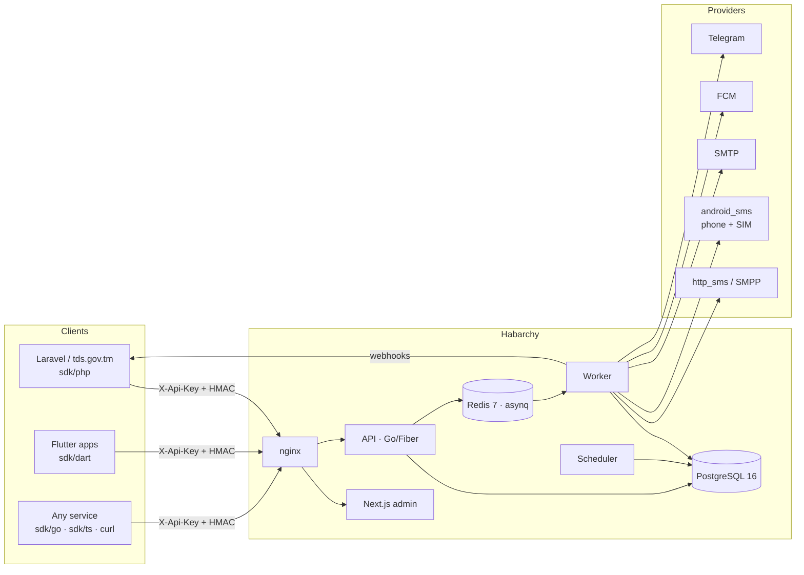

# Habarçy (Habarchy)

**TK:** Habarçy — bir API bilen SMS, e-mail, push (Firebase FCM) we Telegram habarlaryny iberýän, köp proýektli (multi-tenant), nobatly (queue), gaýtadan synanyşýan (retry/fallback), şablonly we loglary bolan merkezi habar şlýuzy. Twilio + SendGrid + OneSignal ýaly, ýöne öz serweriňizde.

**EN:** Habarchy is a self-hosted, multi-tenant notification gateway: one API to send SMS, email, push (FCM) and Telegram messages with queues, retries, provider fallback, templates, delivery status, webhooks and an admin panel.

## Architecture



## Stack

| Part | Tech |
|------|------|
| `backend/` | Go 1.23 + Fiber v2, PostgreSQL, Redis, asynq |
| `web/` | Next.js 15 + TypeScript + Tailwind + shadcn/ui |
| `mobile/` | Flutter 3 + Riverpod + firebase_messaging (admin app) |
| `gateway/` | Flutter + Kotlin foreground service: a phone with a SIM card as SMS provider |
| `sdk/` | Go, TypeScript, Dart, PHP clients |

## Status

In progress — built step by step from [PROMPT.md](PROMPT.md).

| Step | Scope | Status |
|------|-------|--------|
| 1 | Monorepo skeleton, backend config, migrations, domain models, sqlc | ✅ done |
| 2 | Auth (admin JWT + 2FA, API keys + HMAC), projects, members, templates | ✅ done |
| 3 | Messages API, asynq workers, providers (http_sms, smpp, smtp, fcm, telegram), fallback, webhooks, OTP, contacts, devices | ✅ done |
| 4 | Admin API (message log, resend, webhooks, dashboard, usage, health, audit), SSE, usage aggregation, Prometheus, asynqmon | ✅ done |
| 5 | Next.js admin panel (tk/ru/en, dark mode, live feed, template editor, Playwright e2e) + OpenAPI spec at `/api/docs` | ✅ done |
| 6 | Flutter admin app (dashboard, message log, templates, providers, API keys, tk/ru/en, dark mode) + FCM push demo client | ✅ done |
| 6b | Android SMS gateway: `android_sms` provider + Habarçy Gateway APK (phone sends SMS from its SIM, reports sent/delivered, forwards inbound) | ✅ done |
| 7 | SDKs (Go, TypeScript, Dart, PHP/Laravel), Postman collection, Dockerfiles + `deploy/docker-compose.yml` (nginx, web, api, worker, scheduler, postgres, redis, asynqmon), `api -seed`, GitHub Actions (backend, web, flutter, sdks, docker images on tags) | ✅ done |

## Quick start (production-like, one command)

```sh
cp deploy/.env.example deploy/.env      # POSTGRES_PASSWORD, HABARCHY_JWT_SECRET, HABARCHY_MASTER_KEY (openssl rand -hex 32), HABARCHY_PUBLIC_URL, admin e-mail/password
make up                                 # docker compose: nginx :80 → web + api, worker, scheduler, postgres, redis, asynqmon
make seed                               # admin user, demo project, templates otp/welcome/password_reset (tk/ru/en), prints a test API key
open http://localhost/                  # admin panel · http://localhost/api/docs Swagger · http://localhost/asynqmon/ queues
```

Details, TLS with certbot and scaling: [deploy/README.md](deploy/README.md).

## SDKs

| Language | Path | Install | 5-line example |
|----------|------|---------|----------------|
| Go | [`sdk/go`](sdk/go) | `go get github.com/Esca6585dev/habarchy/sdk/go` | [README](sdk/go/README.md) |
| TypeScript / Node | [`sdk/ts`](sdk/ts) | `npm install @habarchy/sdk` (or path) | [README](sdk/ts/README.md) |
| Dart / Flutter | [`sdk/dart`](sdk/dart) | git dependency, `path: sdk/dart` | [README](sdk/dart/README.md) |
| PHP / Laravel 12 | [`sdk/php`](sdk/php) | Composer path repository, auto-discovered provider + facade | [README](sdk/php/README.md) |

All clients: `SendMessage`, `SendBatch`, `GetMessage`, `SendOTP`, `VerifyOTP`, `RegisterDevice`,
optional HMAC request signing (`X-Timestamp` / `X-Signature`). Postman collection with the
same signing as a pre-request script: [docs/habarchy.postman_collection.json](docs/habarchy.postman_collection.json).

## Integrating

**tds.gov.tm (Laravel 12).** `composer config repositories.habarchy path ../habarchy/sdk/php && composer require habarchy/sdk:@dev`,
set `HABARCHY_URL`, `HABARCHY_API_KEY` (a live key with scopes `messages:send messages:read otp`) and
`HABARCHY_SIGN=true` in `.env`, then `Habarchy::sendOTP($phone)` / `Habarchy::verifyOTP($phone, $code)` for
login codes and `Habarchy::sendMessage([...])` for notifications; use `idempotency_key` for anything retried
by a queue, and point the project webhook at a Laravel route to receive `message.delivered` / `message.failed`
(verify `X-Habarchy-Signature`, see [docs/auth.md](docs/auth.md)). Templates are edited by non-developers in
the admin panel (`otp`, `welcome`, `password_reset` in tk/ru/en come pre-installed by `make seed`).

**Flutter apps (push).** Add `sdk/dart`, after login call `registerDevice(token: fcmToken, platform: 'android', externalId: userId)`
with an API key limited to the `devices` scope, and again on `onTokenRefresh`; your backend then sends
`{"channel":"push","to":{"external_id":userId}}` or `"channel":"auto"`. The `mobile/` app's
*Settings → Push demo* and `lib/core/push/push_service.dart` are a working reference for `firebase_messaging`.

**SMS without an operator contract.** Create an `android_sms` provider, install the
[Habarçy Gateway APK](gateway/README.md) on a phone with a SIM card, paste the pairing key. Messages flow
through the phone; keep an `http_sms`/`smpp` provider as fallback once you have a contract.

## Development

```sh
# dependencies
docker compose -f deploy/docker-compose.dev.yml up -d   # Postgres 16 + Redis 7
make -C backend tools                                     # sqlc, goose

# backend
cp backend/.env.example backend/.env                      # set JWT_SECRET and MASTER_KEY
cd backend
go run ./cmd/api -genkey                                  # prints a HABARCHY_MASTER_KEY
make migrate                                              # goose up
HABARCHY_ADMIN_EMAIL=you@example.com HABARCHY_ADMIN_PASSWORD='min 8 chars' go run ./cmd/api -create-admin
make run                                                  # API on :8080  (/healthz, /readyz)
make test                                                 # unit tests; set HABARCHY_TEST_DATABASE_URL + HABARCHY_TEST_REDIS_URL for integration tests
make run-worker                                           # delivers queued messages, posts webhooks (metrics on :9090)
make run-scheduler                                        # partitions, usage_daily aggregation, cleanup
make lint

# web admin (needs the API on :8080)
cd web && cp .env.example .env.local && npm install && npm run dev   # http://localhost:3000

# mobile (Android emulator → host API)
cd mobile && flutter pub get && dart run build_runner build -d && flutter run --flavor dev --dart-define=API_URL=http://10.0.2.2:8080
```

API reference: Swagger UI at `http://localhost:8080/api/docs`, spec in [docs/openapi.yaml](docs/openapi.yaml)
(source: `backend/api/openapi.yaml`, `make -C backend openapi` regenerates the web client types).

See [docs/architecture.md](docs/architecture.md) for the component and data-model diagrams and
[docs/auth.md](docs/auth.md) for login, API keys and request signing.

### API surface so far

| Area | Endpoints |
|------|-----------|
| Admin auth | `POST /api/admin/auth/login`, `/refresh`, `/logout`, `/logout-all`, `GET /me`, `PUT /me/password`, `POST /me/totp/{setup,confirm,disable}` |
| Projects | `GET/POST /api/admin/projects`, `GET/PATCH/DELETE /projects/{id}`, `GET/PUT /members`, `DELETE /members/{user_id}` |
| API keys | `GET/POST /projects/{id}/api-keys`, `DELETE /api-keys/{key_id}` |
| Templates (admin) | `GET/POST /projects/{id}/templates`, `GET/PUT/DELETE /{tid}`, `GET /{tid}/versions`, `POST /{tid}/versions/{v}/restore`, `POST /preview`, `POST /{tid}/preview` |
| Templates (public) | `GET/POST /api/v1/templates`, `GET/PUT/DELETE /{tid}`, `POST /preview`, `GET /api/v1/me` (key auth) |
| Messages (public) | `POST /api/v1/messages` (202), `POST /messages/batch`, `GET /messages?status=&channel=&from=&to=&cursor=&limit=`, `GET /messages/{id}` (+timeline), `POST /messages/{id}/cancel`, `GET /batches/{id}` |
| OTP (public) | `POST /api/v1/otp/send`, `POST /api/v1/otp/verify` |
| Contacts & devices (public) | `GET/POST /api/v1/contacts`, `GET/PUT/DELETE /contacts/{id}`, `GET/POST /api/v1/devices`, `DELETE /devices/{token}` |
| Providers (admin) | `GET/POST /projects/{id}/providers`, `GET/PUT/DELETE /providers/{pid}`, `POST /providers/{pid}/test` |
| Message log (admin) | `GET /projects/{id}/messages?status=&channel=&from=&to=&search=&batch_id=&contact_id=&cursor=`, `GET /messages/{mid}` (timeline + raw provider response + webhooks), `POST /messages/{mid}/resend`, `POST /messages/{mid}/cancel`, `GET /batches`, `GET /batches/{bid}` |
| Webhook log (admin) | `GET /projects/{id}/webhooks?event=&failed=`, `GET /webhooks/{did}`, `POST /webhooks/{did}/resend` |
| Insights (admin) | `GET /projects/{id}/dashboard?days=`, `GET /usage?from=&to=&group_by=&format=csv`, `GET /health`, `GET /audit-logs`, `GET /contacts`, `GET /devices` |
| Live + ops (admin) | `GET /api/admin/stream` (SSE, `?project_id=`, token via header / `?access_token=` / cookie), `GET /api/admin/users`, `POST /users`, `GET /overview`, `/admin/queues` (asynqmon), `GET /metrics` (Prometheus) |
| Usage (public) | `GET /api/v1/usage?from=&to=&group_by=channel\|day` |
| Callbacks | `POST|GET /callbacks/sms/{provider_id}` (HTTP delivery reports) |
| Phone gateway | `GET /api/gateway/v1/me`, `GET /outbox?wait=&limit=` (long poll), `POST /outbox/{id}/result`, `POST /heartbeat`, `POST /inbound` (header `X-Gateway-Key`); admin `GET /providers/{pid}/pairing`, `GET /projects/{id}/inbound` |

### Sending SMS from a phone (no operator contract)

```
admin panel → Providers → Add provider → type android_sms → Save
          → click the provider → Pairing: API URL + gateway key (+ QR)
phone     → install gateway APK (see gateway/README.md) → paste URL + key → Start
curl -X POST $HABARCHY/api/v1/messages -H "X-Api-Key: hb_live_xxx" \
  -d '{"channel":"sms","to":"+99365123456","body":"Salam!"}'      # goes out through the phone's SIM
```

## Quick examples

```sh
# SMS through a template (202 Accepted, delivered asynchronously by the worker)
curl -X POST $HABARCHY/api/v1/messages -H "X-Api-Key: hb_live_xxx" -H 'Content-Type: application/json' \
  -d '{"channel":"sms","to":"+99365123456","template":"otp","data":{"code":"4821","minutes":5},"idempotency_key":"order-77"}'

# Email with an ad hoc body
curl -X POST $HABARCHY/api/v1/messages -H "X-Api-Key: hb_live_xxx" -H 'Content-Type: application/json' \
  -d '{"channel":"email","to":"user@example.tm","subject":"Salam {{.name}}","body":"<p>Hoş geldiňiz, {{.name}}!</p>","data":{"name":"Aman"}}'

# Push to every device of a contact
curl -X POST $HABARCHY/api/v1/messages -H "X-Api-Key: hb_live_xxx" -H 'Content-Type: application/json' \
  -d '{"channel":"push","to":{"external_id":"user-42"},"title":"Täze habar","body":"Resminamaňyz taýýar","metadata":{"data":{"screen":"docs"}}}'

# Telegram
curl -X POST $HABARCHY/api/v1/messages -H "X-Api-Key: hb_live_xxx" -H 'Content-Type: application/json' \
  -d '{"channel":"telegram","to":"123456789","body":"<b>Habarchy</b> işleýär","metadata":{"parse_mode":"HTML"}}'

# Best channel for the contact (project order, default push → sms → email)
curl -X POST $HABARCHY/api/v1/messages -H "X-Api-Key: hb_live_xxx" -H 'Content-Type: application/json' \
  -d '{"channel":"auto","to":{"external_id":"user-42"},"template":"welcome","data":{}}'

# OTP
curl -X POST $HABARCHY/api/v1/otp/send   -H "X-Api-Key: hb_live_xxx" -d '{"channel":"sms","to":"+99365123456"}'
curl -X POST $HABARCHY/api/v1/otp/verify -H "X-Api-Key: hb_live_xxx" -d '{"to":"+99365123456","code":"482193"}'

# Status + timeline
curl $HABARCHY/api/v1/messages/01a1057e-6a9e-7b19-878d-a769d3c78fa8 -H "X-Api-Key: hb_live_xxx"
```

Responses use the envelope `{ "data": ..., "meta": ..., "error": { "code", "message", "details" } }`.
Error codes: `validation_failed`, `unauthorized`, `forbidden_scope`, `not_found`, `quota_exceeded` (429),
`rate_limited` (429), `duplicate_request`, `provider_unavailable`, `invalid_recipient`, `conflict`.
