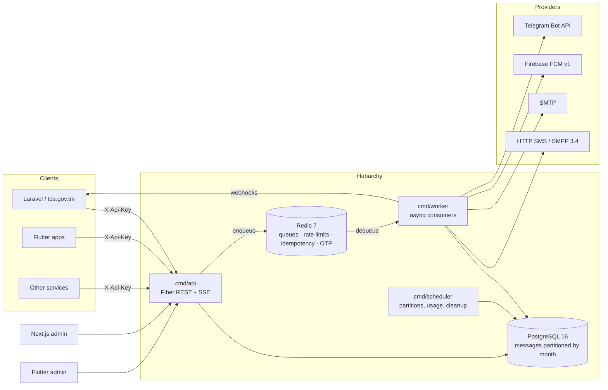
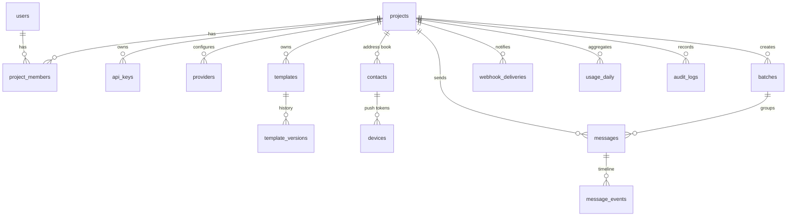
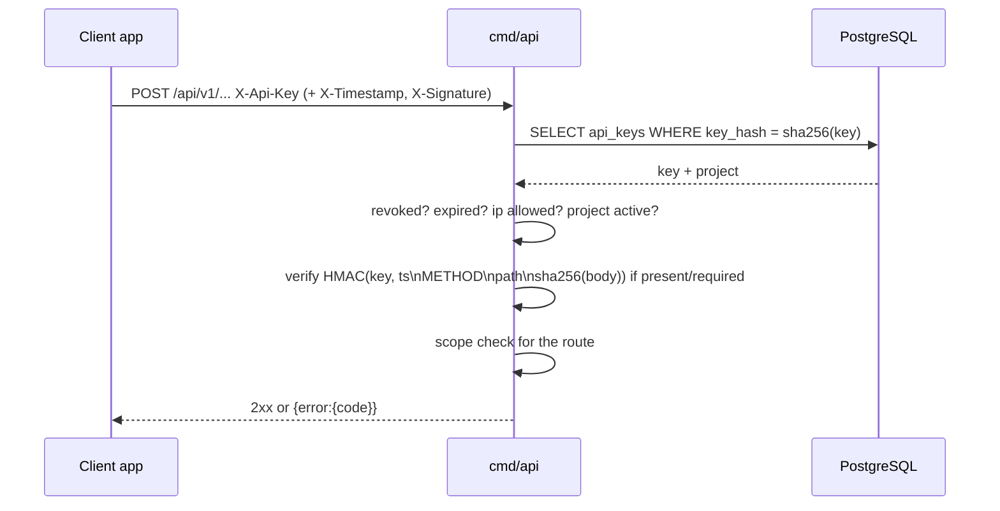
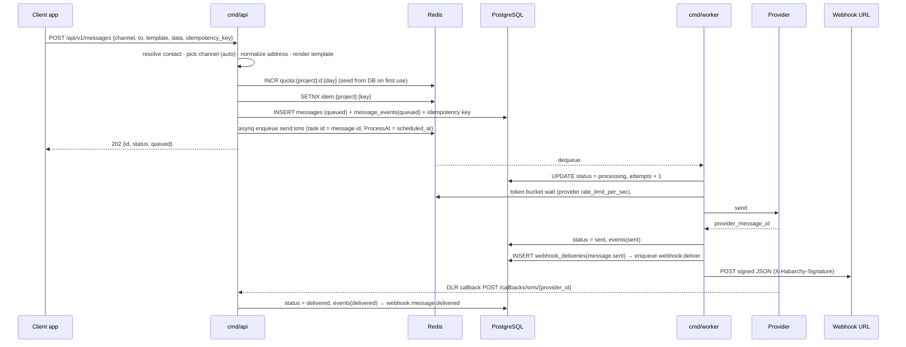
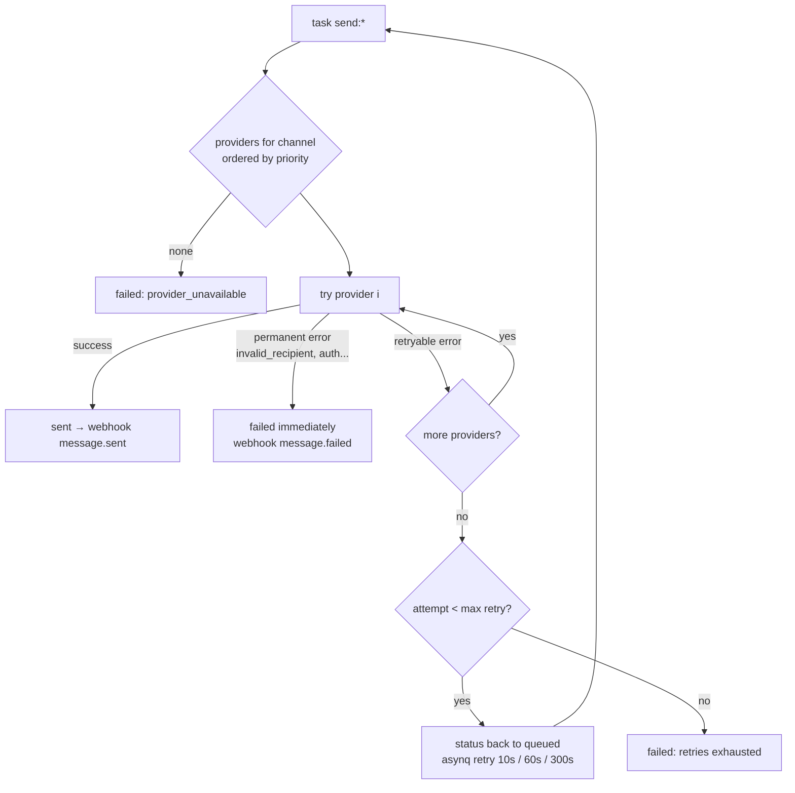
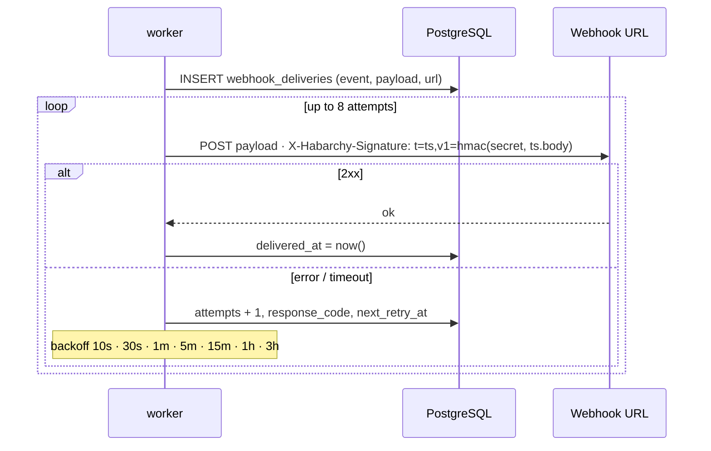

# Architecture

## Components



## Backend layout (clean architecture)

```
backend/
  cmd/{api,worker,scheduler}      entry points
  internal/domain                 entities, enums, error codes (no deps)
  internal/app                    use cases (step 2+)
  internal/ports                  interfaces: providers, queue, cipher
  internal/adapters/http          Fiber server, middleware, JSON envelope
  internal/adapters/postgres      pgx pool, goose migrations, sqlc queries
  internal/adapters/redis         shared Redis client
  internal/adapters/providers     sms/{httpgeneric,smpp} email/smtp push/fcm telegram
  internal/queue                  asynq queue & task names
  internal/scheduler              interval job runner
  migrations/                     goose SQL (embedded)
  pkg/{phone,crypto,ids,logger}   reusable helpers
```

## Data model



Notes:

- `messages` is range-partitioned by month on `created_at`; the primary key is
  `(id, created_at)`. `ensure_messages_partition(date)` creates partitions and the
  scheduler calls it ahead of time. A `messages_default` partition catches strays.
- Idempotency keys are enforced in `message_idempotency_keys` (true unique
  constraint) plus Redis for 24 h; a unique index on a partitioned table would
  have to include the partition key.
- Provider credentials, webhook secrets and TOTP seeds are AES-256-GCM encrypted
  with `HABARCHY_MASTER_KEY`; API keys are stored as SHA-256 hashes.

## Request authentication



Details in [auth.md](auth.md).

## Send sequence



## Provider fallback and retries



Test API keys (`hb_test_`) skip the provider list and use the sandbox, which accepts
every message and marks it delivered (addresses containing `FAIL` / `RETRY` force errors).

## Webhook delivery and retry



Events: `message.sent`, `message.delivered`, `message.failed`, `batch.completed`.
Receivers verify with HMAC-SHA256 over `"<timestamp>.<raw body>"` using the project's
webhook secret and reject timestamps older than a few minutes (see [auth.md](auth.md)).
